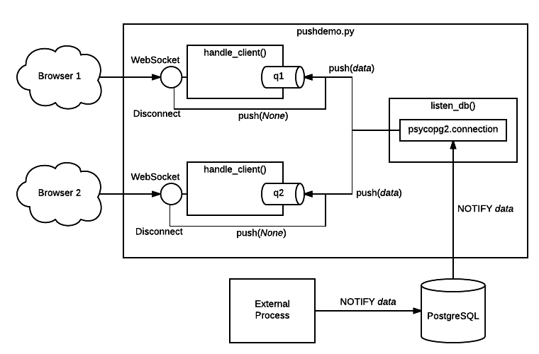

================================
*psycopg*: Python for PostgreSQL
================================

.. image:: img/psycopg.png

.. class:: text-right

    PGConf.Online 2021, ``'[2021-03-01,2021-03-04)'::daterange``

    Daniele Varrazzo

..
    Note to piro: you want
    :autocmd BufWritePost psycopg.rst :silent !make html

----

What is ``psycopg2``?
=====================

.. class:: font-bigger

    + ⚙️ industry standard Python-PostgreSQL adapter

    + 💪 libpq based

    + ⚖️ 50% C, 50% Python

    + (🐍+🇨)+🐘=❤️

----

Have your virtualenv!
===========

.. code-block:: sh

   $ python3 -m venv env
   $ source env/bin/activate
   (env) $ 

----

Basic usage: import
===================

.. code-block:: python

    import psycopg2

----

Zoom: installation
==================

.. class:: font-bigger

   * ``pip install psycopg2``
    
     + if you have C compiler and client libraries

   * ``pip install psycopg2-binary``
    
     + on supported platforms (no Alpine Docker image)

   * They both install a ``psycopg2`` package

     + ``import psycopg2`` from Python

   * They cannot coexist, so writing ``requirements.txt`` is problematic

     + You should depend on ``psycopg2``

     + You can use ``psycopg2-binary`` for interactive hacking

----

Installation for ``psycopg3``
=============================

.. class:: font-bigger

   **Not yet on PyPI** but this is the plan:

   * ``pip install psycopg3``

     + pure Python (requires client libraries)

   * ``pip install psycopg3[c]``: 

     + Faster (requires client libraries and C compiler)

   * ``pip install psycopg3[binary]``: 

     + Faster, no dependency, on supported platforms

   * You can have projects specifying ``psycopg3`` only, and use the "speedup
     extra" you may need.

----

Basic usage: connection
=======================

.. code-block:: python

    import psycopg2

    conn = psycopg2.connect("dbname=piro")

----

Zoom in: connection
===================

* You can connect with keywords or with a connection string

.. code-block:: python

    conn = psycopg2.connect("dbname=piro user=piro host=somewhere")
    conn = psycopg2.connect(dbname="piro" user="piro" host="somewhere")

* **Tip:** don't bother with keywords: have the connection string in the settings
* Why? Because you can use the same with ``psql`` (and ``pg_dump``, etc.)

.. code-block:: sh

    psql "dbname=piro user=piro host=somewhere"

* Easier to configure (can use a single env var)
* If you need to access the single parts you can use
  ``psycopg2.extensions.parse_dsn()``
* **Note:** you can also use ``PG*`` `env vars`__ (``PGDATABASE``,
  ``PGUSER``...)

.. __: https://www.postgresql.org/docs/current/libpq-envars.html

----

Basic usage: cursor
===================

.. code-block:: python

    import psycopg2

    conn = psycopg2.connect("dbname=piro")
    cur = conn.cursor()

----

cursor? 🤔
==========

----

No such a thing in psql...
==========================

.. class:: font-bigger

    + DBAPI design:

      + connections manage sessions and transactions
      
      + cursors manage queries and results

      + inspired to server-side cursors, but normally in psycopg2 the state is
        on the client...

----

Basic usage: execute
====================

.. code-block:: python

    import psycopg2

    conn = psycopg2.connect("dbname=piro")
    cur = conn.cursor()
    cur.execute("select * from generate_series(1, 10)")

----

Adaptation
==========

.. image:: img/py-to-pg.png

.. class:: font-bigger

    + Using Python variables in an SQL query

.. code-block:: python

    cur.execute(
        "select %s, %s",    # query, with placeholders
        (10, 20))           # sequence of params

    cur.execute(
        "select %(a)s, %(b)s",  # query, with named placeholders
        {"a": 10, "b": 20})     # mapping of params

.. class:: font-bigger

    + Any possible query (psycopg doesn't do any parsing)

----

Adaptation
==========

.. image:: img/py-to-pg.png

.. class:: font-bigger

    + **DANGER!** Don't do this!

.. code-block:: pycon

    >>> cur.execute("select '%s' || '%s'" % ('a', 'b'))
    >>> cur.fetchone()
    ('ab',)

    >>> cur.execute("select '%s' || '%s'" % ("O'Reilly", ' Books'))
    Traceback (most recent call last):
      File "<ipython-input-29-720a7746fc83>", line 1, in <module>
        cur.execute("select '%s' || '%s'" % ("O'Reilly", ' Books'))
    ProgrammingError: syntax error at or near "' || '"
    LINE 1: select 'O'Reilly' || ' Books'

.. class:: font-bigger

    + Don't use string concatenation, string formatting

----

Adaptation
==========

.. image:: img/py-to-pg.png

.. class:: font-bigger

    + The wrong way 👎

.. code-block:: pycon

    >>> cur.execute("select '%s' || '%s'" % (var1, var2))

.. class:: font-bigger

    + The right way 👍

      - No quotes around placeholders
      - No use of ``%`` or ``+`` string operators

.. code-block:: pycon

    >>> cur.execute("select %s || %s", (var1, var2))

.. class:: font-bigger

----

Adaptation
==========

* Mandatory reference

.. image:: img/exploits_of_a_mom.png

.. code-block:: pycon

    >>> cur.execute("INSERT INTO students (name) VALUES ('%s')" % name)

* Would become:

.. code-block:: SQL

    INSERT INTO students (name)
        VALUES ('Robert'); DROP TABLE students; --')

* Funny, but wrong conclusion: *do not sanitise inputs, let the driver do it!*

.. code-block:: pycon

    >>> cur.execute("insert into students (name) values (%s)" , [name])

----

Adaptation: only for values
===========================

.. class:: font-bigger

   * It doesn't work if you have tables/fields names in variables

.. code-block:: pycon

    >>> cur.execute(
    ...     "insert into %s values (%s, %s)" ,
    ...     ["table_name", 10, 20])
    SyntaxError: syntax error at or near "'table_name'"
    LINE 1: insert into 'table_name' values (10, 20)
                        ^

.. class:: font-bigger

   * You can use the ``psycopg2.sql`` module to compose queries dynamically

.. code-block:: pycon

    >>> from psycopg2 import sql
    >>> cur.execute(
    ...     sql.SQL("insert into {} values (%s, %s)")
    ...         .format(sql.Identifier("table_name"))
    ...     [10, 20])
    UndefinedTable: relation "table_name" does not exist
    LINE 1: insert into "table_name" values (10, 20)
                        ^
.. class:: font-bigger

   * That's a better error 😅

----

Data type mapping
=================

Default data types mapping: no surprise here

.. table::
    :class: data-types

    +---------------+-----------------+
    | Python        | PostgreSQL      |
    +===============+=================+
    | ``None``      | ``NULL``        |
    +---------------+-----------------+
    | ``bool``      | ``bool``        |
    +---------------+-----------------+
    | ``int``       | ``smallint``,   |
    |               | ``integer``,    |
    |               | ``bigint``      |
    +---------------+-----------------+
    | ``float``     | ``real``,       |
    |               | ``double``      |
    +---------------+-----------------+
    | ``Decimal``   | ``numeric``     |
    +---------------+-----------------+
    | ``str``       | ``varchar``,    |
    |               | ``text``        |
    +---------------+-----------------+
    | ``date``      | ``date``        |
    +---------------+-----------------+
    | ``time``      | ``time``        |
    +---------------+-----------------+
    | ``datetime``  | ``timestamp``,  |
    |               | ``timestamptz`` |
    +---------------+-----------------+
    | ``timedelta`` | ``interval``    |
    +---------------+-----------------+

----

More Data!
==========

- ``list`` <-> ``ARRAY``

.. code-block:: python

  >>> cur.execute("""select array_agg(d)::date[]
      from generate_series('2013-07-11'::date, '2013-07-12'::date,
          '1 day'::interval) s(d)""")
  # [datetime.date(2013, 7, 11), datetime.date(2013, 7, 12)]

- [``named``] ``tuple`` <-> composite

.. code-block:: python

  >>> cur.execute("CREATE TYPE card AS (value int, suit text)")
  >>> psycopg2.extras.register_composite('card', cur)
  >>> cur.execute("select (8, 'hearts')::card")
  # card(value=8, suit='hearts')

- Psycopg ``Range`` object <-> ``range``

.. code-block:: python

  >>> cur.execute("select '[0,10)'::int8range")
  # NumericRange(0, 10, '[)')
  >>> r.upper_inc, r.lower_inc
  (False, True)

----

Mythical JSON(B)!
================

.. class:: font-bigger

    * Anything™ <-> ``json``, ``jsonb``
    * Need to use a ``Json()`` wrapper to mark you want JSON dumping

.. code-block:: python

  >>> cur.execute("insert into mytable (jsondata) values (%s)",
      [Json({'a': 100})])

----

Basic usage: fetching results
=============================

.. code-block:: python

    import psycopg2

    conn = psycopg2.connect("dbname=piro")
    cur = conn.cursor()
    cur.execute("select * from generate_series(1, 10)")

    cur.fetchone()
    (1,)

    cur.fetchmany(3)
    [(2,), (3,), (4,)]

    cur.fetchall()
    [(5,), (6,), (7,), (8,), (9,), (10,)]

    cur.fetchone() is None
    True
----

Basic usage: iterating on results
=================================

.. code-block:: python

    import psycopg2

    conn = psycopg2.connect("dbname=piro")
    cur = conn.cursor()
    cur.execute("select * from generate_series(1, 10)")

    for row in cur:
        print(row)
    
    (1,)
    (2,)
    (3,)
    (4,)
    (5,)
    (6,)
    (7,)
    (8,)
    (9,)
    (10,)

----

Waiting for ``psycopg3``: ``conn.execute()``
============================================

.. class:: font-bigger

    * A more familar pattern

.. code-block:: python

   with psycopg3.connection(...) as conn:
       res = conn.execute(query)
       print(res.fetchall())
           
.. class:: font-bigger

    * Not really a new object: it's still a cursor
    * Just pretend the ``fetch()`` methods are not there 😉

----

Other types of records
======================

.. code-block:: pycon

    >>> from psycopg2 import extras

    >>> cur = cnn.cursor(cursor_factory=extras.NamedTupleCursor)
    >>> cur.execute(
    ...     "select 10 as a, 'hello' as b, '2020-02-01'::date as d")
    >>> cur.fetchone()
    Record(a=10, b='hello', d=datetime.date(2020, 2, 1))

    >>> cur = cnn.cursor(cursor_factory=extras.RealDictCursor)
    >>> cur.execute(
    ...     "select 10 as a, 'hello' as b, '2020-02-01'::date as d")
    >>> cur.fetchone()
    {'a': 10, 'b': 'hello', 'd': datetime.date(2020, 2, 1)}

----

Server and Client Cursors
=========================

.. code-block:: python

    cur = conn.cursor()
    cur.execute("select * from my_million_rows_table")
    # you get 1M rows on the client
    cur.fetchone()

.. class:: font-bigger

   The result is transferred completely to the client

.. code-block:: python

    cur = conn.cursor("my-cursor")
    cur.execute("select * from my_million_rows_table")
    # runs DECLARE "my-cursor" CURSOR FOR select * ...
    cur.fetchone()
    # you get one row

.. class:: font-bigger

   Only the rows needed are transferred to the client

----

Running queries: auto-transaction
=================================

.. class:: font-bigger

    + ``psycopg2`` starts a transaction at every new statement.

.. code-block:: pycon

    >>> cur.execute("select current_time")
    >>> print(cur.fetchone()[0])
    12:45:10.919226+00:00

    >>> cur.execute("select current_time")
    >>> print(cur.fetchone()[0])
    12:45:10.919226+00:00

    # same time! we are in a transaction

.. class:: font-bigger

    + Don't leave connections idle in transaction!

::

    piro=# select pid, state from pg_stat_activity
    piro-# where state is not null;
    ┌─────────┬─────────────────────┐
    │   pid   │        state        │
    ├─────────┼─────────────────────┤
    │  965924 │ idle                │
    │ 1486322 │ idle in transaction │
    │ 1486371 │ active              │
    └─────────┴─────────────────────┘

----

Remember to close your transactions!
====================================

.. class:: font-bigger

    + You can use ``with`` on the connection to represent a transaction

.. code-block:: pycon

    >>> conn = psycopg2.connect("")
    >>> cur = conn.cursor()

    >>> cur.execute("select current_time")
    >>> print(cur.fetchone()[0])
    12:55:25.717751+00:00

    >>> conn.commit()

    >>> cur.execute("select current_time")
    >>> print(cur.fetchone()[0])
    12:55:27.385814+00:00

    >>> conn.rollback()

----

Autocommit mode
===============

.. class:: font-bigger

    + ...or you can go without transactions

.. code-block:: pycon

    >>> conn.autocommt = True

    >>> cur.execute("select current_time")
    >>> print(cur.fetchone()[0])
    12:55:25.717751+00:00
    >>> cur.execute("select current_time")
    >>> print(cur.fetchone()[0])
    12:55:27.385814+00:00

.. class:: font-bigger

    + Necessary for certain statements

      + ``CREATE DATABASE``
      + ``CREATE INDEX CONCURRENTLY``

----

Using blocks to close transactions
==================================

.. code-block:: pycon

    >>> conn = psycopg2.connect("")
    >>> cur = conn.cursor()

    >>> with conn:
    ...     cur.execute("select current_time")
    ...     print(cur.fetchone()[0])
    12:55:25.717751+00:00

    >>> with conn:
    ...     cur.execute("select current_time")
    ...     print(cur.fetchone()[0])
    12:55:27.385814+00:00

.. class:: font-bigger

    + Commit leaving the block, roll back in case of error
    + A bit of unnatural usage of ``with`` though...

----

Waiting for psycopg3: explicit transactions
===========================================

.. class:: font-bigger

    + ``with conn`` closes the connection
    + ``with conn.transaction()`` delimits a transaction
    + It can be nested!

.. code-block:: python3

    with psycopg3.connect(CONNINFO) as conn:

        with conn.transaction() as tx1:
            num_ok = 0
            for operation in operations:
                try:
                    with conn.transaction() as tx2:
                        unreliable_operation(conn, operation)
                except Exception:
                    logger.exception(f"{operation} failed")
                else:
                    num_ok += 1

            save_number_of_successes(conn, num_ok)

        # here the transaction is terminated

    # here the connection is closed

----

Typecasting
===========

.. image:: img/pg-to-py.png

.. class:: font-bigger

    - Converting data from Postgres to Python
    - Typecasters have:

      1. one or more OID
      2. a name
      3. a conversion function

----

``pushdemo.py`` architecture
============================

----

Async notification demo
=======================

Using gevent__, gevent-websocket__, psycogreen__

.. __: http://www.gevent.org/
.. __: http://www.gelens.org/code/gevent-websocket/
.. __: https://bitbucket.org/dvarrazzo/psycogreen/

.. class:: apology

    This demo requires the ``pushdemo.py`` script running.

.. raw:: html

    
    
    
    
&nbsp;

    
&nbsp;

    
&nbsp;

    

.. class:: text-right

    Demo code at https://github.com/dvarrazzo/psycopg-training-pgconf-2021

----

Async notification demo (offline)
=================================

.. image:: img/pushdemo.png

----

🤔 Questions?
=============

----

🥰 Thank you!
=============
