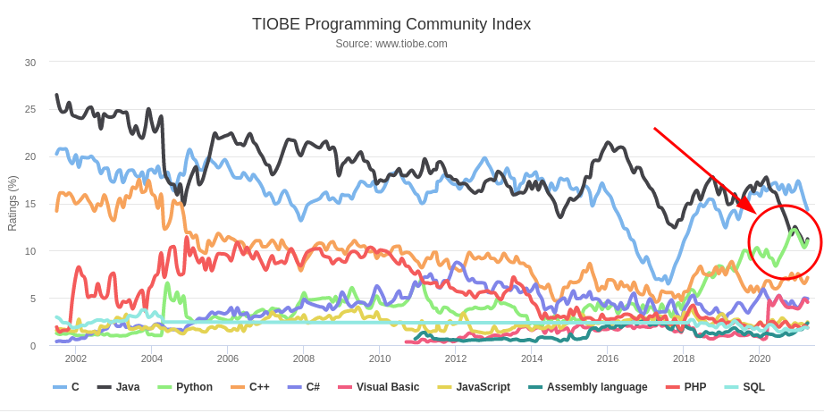
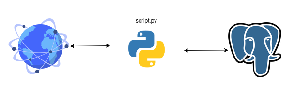
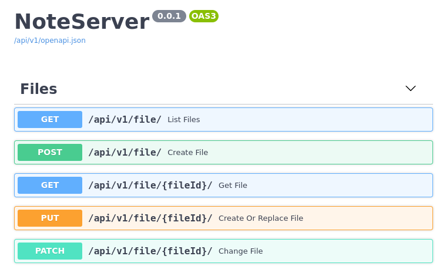
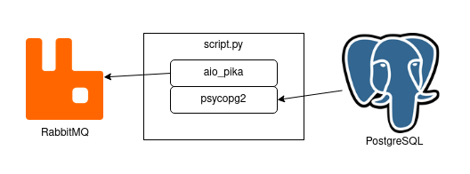

================================
*psycopg*: Python for PostgreSQL
================================
The present and the future
--------------------------

.. image:: img/psycopg.png

.. class:: text-right

    Postgres London 2021, ``'2021-05-12'::date``

    Daniele Varrazzo

..
    Note to piro: you want
    :autocmd BufWritePost psycopg.rst :silent !make html

----

What is Python?
===============

.. class:: font-bigger

    Hardly the outsider anymore...

----

What is Python?
===============

.. class:: font-bigger

    - Easy to use

      - Simple syntax

      - Good teaching language

      - Plenty of tutorials

    - Interfaces with everything

      - Easy parsing of text and binary

      - Libraries likely available for any protocol

----

Is it any good with PostgreSQL?
===============================

.. class:: font-bigger

    - tl; dr: hell yeah!

    - Note: we talk about Python as external language

      - Python as procedural language not considered here

----

Is it any good with PostgreSQL?
===============================

.. class:: font-bigger

    - Do you really want to do everything *inside* the database?

      - Do you send email from inside the database?

      - Do you query a web service from your SQL query?

      - Do you format protobuffer, or compress a zip file, inside a database?

    - You can do all of that, but it's not necessarily a good idea

      - You would likely use PL/Python anyway...

----

Just write a program
====================

.. class:: font-bigger

    - Many tasks are better performed outside the database

      - For scalability, deployment, maintenance, 

.. class:: font-bigger

    - You want a simple language to interface with the outside
    
      - Talking PostgreSQL fluently!

----

psycopg2
========

----

What is ``psycopg2``?
=====================

.. class:: font-bigger

    + ⚙️ industry standard Python-PostgreSQL adapter

    + 💪 libpq based

    + ⚖️ 50% C, 50% Python

    + (🐍+🇨)+🐘=❤️

----

Installation
============

.. class:: font-bigger

   * Isolate your environment!

.. code-block:: sh

   $ python3 -m venv env
   $ source env/bin/activate
   (env) $ pip install psycopg2  # requires libpq installed
   # or
   (env) $ pip install psycopg2-binary  # on many but not all platforms

.. class:: font-bigger

   - Keep app dependencies separate from system dependencies

   - Docker is even better

     - Isolate both Python and non-python dependencies

----

Basic usage
===========

.. class:: font-bigger

   - Import it in your project

.. code-block:: python

    import psycopg2

.. class:: font-bigger

   - Create a database connection

.. code-block:: python

    conn = psycopg2.connect("dbname=piro")

----

Basic usage: running a query
============================

.. class:: font-bigger

   * In the DBAPI model you need a **cursor**

     * Can be a server side cursor (DECLARE)
     * Or just a client construct holding a result

.. code-block:: python

    import psycopg2

    conn = psycopg2.connect("dbname=piro")

    cur = conn.cursor()
    cur.execute("select * from generate_series(1, 10)")

.. class:: font-bigger

   - Optional to run simple queries in ``psycopg3``

----

Basic usage: fetching results
=============================

.. code-block:: python

    import psycopg2

    conn = psycopg2.connect("dbname=piro")
    cur = conn.cursor()
    cur.execute("select * from generate_series(1, 10)")

    cur.fetchone()
    (1,)

    cur.fetchmany(3)
    [(2,), (3,), (4,)]

    cur.fetchall()
    [(5,), (6,), (7,), (8,), (9,), (10,)]

    cur.fetchone() is None
    True

----

Basic usage: iterating on results
=================================

.. code-block:: python

    import psycopg2

    conn = psycopg2.connect("dbname=piro")
    cur = conn.cursor()
    cur.execute("select * from generate_series(1, 10)")

    for row in cur:
        print(row)
    
    (1,)
    (2,)
    (3,)
    (4,)
    (5,)
    (6,)
    (7,)
    (8,)
    (9,)
    (10,)

----

Adaptation
==========

.. class:: font-bigger

    + Using Python variables in an SQL query

.. code-block:: python

    cur.execute(
        "select %s, %s",    # query, with placeholders
        (10, 20))           # sequence of params

    cur.execute(
        "select %(a)s, %(b)s",  # query, with named placeholders
        {"a": 10, "b": 20})     # mapping of params

.. class:: font-bigger

    + Any possible query (psycopg doesn't do any parsing)

----

Adaptation
==========

.. class:: font-bigger

    + **DANGER!** Don't do this!

.. code-block:: pycon

    >>> cur.execute("select '%s' || '%s'" % ('a', 'b'))
    >>> cur.fetchone()
    ('ab',)

    >>> cur.execute("select '%s' || '%s'" % ("O'Reilly", ' Books'))
    Traceback (most recent call last):
      File "<ipython-input-29-720a7746fc83>", line 1, in <module>
        cur.execute("select '%s' || '%s'" % ("O'Reilly", ' Books'))
    ProgrammingError: syntax error at or near "' || '"
    LINE 1: select 'O'Reilly' || ' Books'

.. class:: font-bigger

    + Don't use string concatenation, string formatting

----

Adaptation
==========

.. class:: font-bigger

    + The wrong way 👎

.. code-block:: pycon

    >>> cur.execute("select '%s' || '%s'" % (var1, var2))

.. class:: font-bigger

    + The right way 👍

      - No quotes around placeholders
      - No use of ``%`` or ``+`` string operators

.. code-block:: pycon

    >>> cur.execute("select %s || %s", (var1, var2))

.. class:: font-bigger

----

Typecasting
===========

.. class:: font-bigger

    - Converting data from Postgres to Python
    - Typecasters have:

      1. one or more OID
      2. a name
      3. a conversion function

----

Data type mapping
=================

.. class:: font-bigger

    * Default data types mapping
    * Widely customisable

.. table::
    :class: data-types

    +---------------+-----------------+
    | Python        | PostgreSQL      |
    +===============+=================+
    | ``None``      | ``NULL``        |
    +---------------+-----------------+
    | ``bool``      | ``bool``        |
    +---------------+-----------------+
    | ``int``       | ``smallint``,   |
    |               | ``integer``,    |
    |               | ``bigint``,     |
    |               | ``numeric``     |
    +---------------+-----------------+
    | ``float``     | ``real``,       |
    |               | ``double``      |
    +---------------+-----------------+
    | ``Decimal``   | ``numeric``     |
    +---------------+-----------------+
    | ``str``       | ``varchar``,    |
    |               | ``text``        |
    +---------------+-----------------+
    | ``date``      | ``date``        |
    +---------------+-----------------+
    | ``time``      | ``time``        |
    +---------------+-----------------+
    | ``datetime``  | ``timestamp``,  |
    |               | ``timestamptz`` |
    +---------------+-----------------+
    | ``timedelta`` | ``interval``    |
    +---------------+-----------------+

----

Basic usage
===========

The roles of the main actors

.. code-block:: python

    import psycopg2                         # the driver
    conn = psycopg2.connect("dbname=piro")  # the connection/session
    cur = conn.cursor()                     # the cursor - holds results

    cur.execute("select %s, %s", [10, "foo"])   # sends command
    cur.fetchone()                              # retrieve results
    conn.commit()                               # controls the session

Different ways to consume data

.. code-block:: python

    cur.fetchone()      # returns one tuples
    cur.fetchmany(n)    # returns a list of n tuples
    cur.fetchall()      # returns a list with all the tuples
    for record in cur:
        ...             # iterable of tuples

-----

What do you do with it?
=======================

-----

Consume a web service
=====================

.. code-block:: python

   import requests

- Query HTTP/HTTPS services
- JSON conversion
- Preprocess data before sending to database

.. image:: img/requests.png
   :width: 700px

-----

Write a web service!
====================

.. code-block:: python

   import fastapi

- Your new BFF forever to write strongly typed REST APIs

-----

Send messages around
====================

.. code-block:: python

   import aio_pika

- Drive events from PostgreSQL notifications

-----

So, it everything all sorted?
=============================

.. class:: font-bigger

   * No!

     * 🐍 Python has evolved
     * 🐘 Postgres has evolved
     * 💡 Changes are needed

   * **psycopg3** is on the way!

----

Support for ``asyncio`` 🏹
==========================

.. class:: font-bigger

    + Allows for collaborative parallelism

      - Control flow switch when I/O is performed

    + Available in current Python 3 versions

.. code-block:: python3

   from psycopg3 import AsyncConnection

   async with AsyncConnection.connect(CONNINFO) as conn:
       cur = await conn.execute("SELECT * FROM table")
           print(await cur.fetchall())

----

Transactions as blocks 🤝
=========================

.. class:: font-bigger

    + Support for transactions (nested, with ``SAVEPOINT``)

.. code-block:: python3

    conn = psycopg3.connect(CONNINFO)

    with conn.transaction() as tx1:
        num_ok = 0
        for operation in operations:
            try:
                with conn.transaction() as tx2:
                    unreliable_operation(conn, operation)
            except Exception:
                logger.exception(f"{operation} failed")
            else:
                num_ok += 1

        save_number_of_successes(conn, num_ok)

----

COPY with Python objects 🚛
===========================

* Supports text and binary format
* Copy by record (Python values) or block (preformatted)
* Allow for async COPY (if producer/consumer is async)

.. code-block:: python3

    records = [(10, 20, "hello"), (40, None, "world")]

    with cursor.copy(
        "COPY sample (col1, col2, col3) FROM STDIN"
    ) as copy:
        for record in records:
            copy.write_row(record)

.. code-block:: python3

    with open("data.out", "wb") as f:
        with cursor.copy("COPY table_name TO STDOUT") as copy:
            for data in copy:
                f.write(data)

----

...and much more
================

.. class:: font-bigger

   * Prepared statements
   * Binary parameters
   * Easier notifications
   * libpq low-level access
   * Pure Python implementation
   * ...

----

``psycopg3`` needs you!
=======================

.. class:: font-bigger

    +  Close to release!
    +  Crowdfunded free-software project

.. class:: sponsors

   .. image:: img/sponsors.png
       :width: 500px

.. class:: font-bigger

    +  💜 `Contributions and sponsorship welcome`__

.. __: https://github.com/sponsors/dvarrazzo/

----

🤔 Questions?
=============

----

🥰 Thank you!
=============
