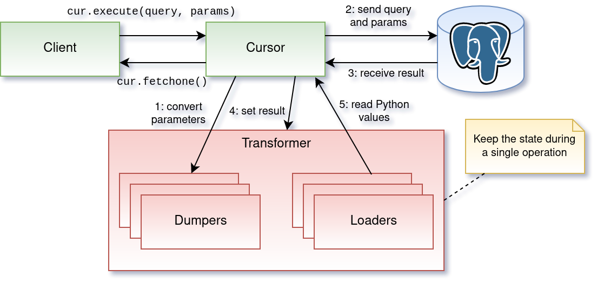

================================
*psycopg*: Python for PostgreSQL
================================

.. image:: img/psycopg.png

.. class:: text-right

    PGConf.Online 2021, ``'[2021-03-01,2021-03-04)'::daterange``

    Daniele Varrazzo

..
    Note to piro: you want
    :autocmd BufWritePost psycopg.rst :silent !make html

----

Basic usage
===========

The roles of the main actors

.. code-block:: python

    import psycopg2                         # the driver
    conn = psycopg2.connect("dbname=piro")  # the connection/session
    cur = conn.cursor()                     # the cursor - holds results

    cur.execute("select 10 as a, 'foo' as b")   # sends command
    cur.fetchone()                              # retrieve results
    conn.commit()                               # controls the session

Different ways to consume data

.. code-block:: python

    cur.fetchone()      # returns one tuples
    cur.fetchmany(n)    # returns a list of n tuples
    cur.fetchall()      # returns a list with all the tuples
    for t in cur:
        pass            # iterable of tuples

----

Zoom in: connection
===================

* You can connect with keywords or with a connection string

.. code-block:: python

    conn = psycopg2.connect("dbname=piro user=piro host=somewhere")
    conn = psycopg2.connect(dbname="piro" user="piro" host="somewhere")

* **Tip:** don't bother with keywords: have the connection string in the settings
* Why? Because you can use the same with ``psql`` (and ``pg_dump``, etc.)

.. code-block:: sh

    psql "dbname=piro user=piro host=somewhere"

* Easier to configure (can use a single env var)
* If you need to access the single parts you can use
  ``psycopg2.extensions.parse_dsn()``
* **Note:** you can also use ``PG*`` `env vars`__ (``PGDATABASE``,
  ``PGUSER``...)

.. __: https://www.postgresql.org/docs/current/libpq-envars.html

----

Data type mapping
=================

Default data types mapping: no surprise here

.. table::
    :class: data-types

    +---------------+-----------------+
    | Python        | PostgreSQL      |
    +===============+=================+
    | ``None``      | ``NULL``        |
    +---------------+-----------------+
    | ``bool``      | ``bool``        |
    +---------------+-----------------+
    | ``int``       | ``smallint``,   |
    |               | ``integer``,    |
    |               | ``bigint``      |
    +---------------+-----------------+
    | ``float``     | ``real``,       |
    |               | ``double``      |
    +---------------+-----------------+
    | ``Decimal``   | ``numeric``     |
    +---------------+-----------------+
    | ``str``,      | ``varchar``,    |
    |               | ``text``        |
    +---------------+-----------------+
    | ``date``      | ``date``        |
    +---------------+-----------------+
    | ``time``      | ``time``        |
    +---------------+-----------------+
    | ``datetime``  | ``timestamp``,  |
    |               | ``timestamptz`` |
    +---------------+-----------------+
    | ``timedelta`` | ``interval``    |
    +---------------+-----------------+

----

More Data!
==========

- ``list`` <-> ``ARRAY``

.. code-block:: python

  >>> cur.execute("""select array_agg(d)::date[]
      from generate_series('2013-07-11'::date, '2013-07-12'::date,
          '1 day'::interval) s(d)""")
  # [datetime.date(2013, 7, 11), datetime.date(2013, 7, 12)]

- [``named``] ``tuple`` <-> composite

.. code-block:: python

  >>> cur.execute("CREATE TYPE card AS (value int, suit text)")
  >>> psycopg2.extras.register_composite('card', cur)
  >>> cur.execute("select (8, 'hearts')::card")
  # card(value=8, suit='hearts')

- Psycopg ``Range`` object <-> ``range``

.. code-block:: python

  >>> cur.execute("select '[0,10)'::int8range")
  # NumericRange(0, 10, '[)')
  >>> r.upper_inc, r.lower_inc
  (False, True)

----

Mythical JSON(B)!
================

.. class:: font-bigger

    * Anything™ <-> ``json``, ``jsonb``
    * Need to use a ``Json()`` wrapper to mark you want JSON dumping

.. code-block:: python

  >>> cur.execute("insert into mytable (jsondata) values (%s)",
      [Json({'a': 100})])

----

Adaptation
==========

.. class:: font-bigger

    + Using Python variables in an SQL query

.. code-block:: python

    cur.execute(
        "select %s, %s",    # query, with placeholders
        (10, 20))           # sequence of params

    cur.execute(
        "select %(a)s, %(b)s",  # query, with named placeholders
        {"a": 10, "b": 20})     # mapping of params

.. class:: font-bigger

    + Any possible query (psycopg doesn't do any parsing)

----

Adaptation
==========

.. class:: font-bigger

    + **DANGER!** Don't do this!

.. code-block:: pycon

    >>> cur.execute("select '%s' || '%s'" % ('a', 'b'))
    >>> cur.fetchone()
    ('ab',)

    >>> cur.execute("select '%s' || '%s'" % ("O'Reilly", ' Books'))
    Traceback (most recent call last):
      File "<ipython-input-29-720a7746fc83>", line 1, in <module>
        cur.execute("select '%s' || '%s'" % ("O'Reilly", ' Books'))
    ProgrammingError: syntax error at or near "' || '"
    LINE 1: select 'O'Reilly' || ' Books'

.. class:: font-bigger

    + Don't use string concatenation, string formatting

----

Adaptation
==========

.. class:: font-bigger

    + The wrong way 👎

.. code-block:: pycon

    >>> cur.execute("select '%s' || '%s'" % (var1, var2))

.. class:: font-bigger

    + The right way 👍

      - No quotes around placeholders
      - No use of ``%`` or ``+`` string operators

.. code-block:: pycon

    >>> cur.execute("select %s || %s", (var1, var2))

.. class:: font-bigger

----

Adaptation
==========

* Mandatory reference

.. image:: img/exploits_of_a_mom.png

.. code-block:: pycon

    >>> cur.execute("INSERT INTO students (name) VALUES ('%s')" % name)

* Would become:

.. code-block:: SQL

    INSERT INTO students (name)
        VALUES ('Robert'); DROP TABLE students; --')

* Funny, but wrong conclusion: *do not sanitise inputs, let the driver do it!*

.. code-block:: pycon

    >>> cur.execute("insert into students (name) values (%s)" , [name])

----

Typecasting
===========

.. image:: img/pg-to-py.png

.. class:: font-bigger

    - Converting data from Postgres to Python
    - Typecasters have:

      1. one or more OID
      2. a name
      3. a conversion function

----

Typecasting
===========

.. image:: img/pg-to-py.png

Customizing a typecaster

.. code-block:: pycon

    >>> cur.execute("select 123.45")
    >>> cur.fetchone()
    (Decimal('123.45'),)  # By default, numeric -> Decimal

    >>> from psycopg2 import extensions as ext

    >>> def num2float(s, cur):
    ...     if s is None:
    ...         return float(s)

    >>> t = ext.new_type((1700,), "NUM2FLOAT", num2float)
    >>> ext.register_type(t, cur)

    >>> cur.execute("select 123.45")
    >>> cur.fetchone()
    (123.45,)  # You can choose to obtain floats instead

----

Waiting for psycopg3
====================

* Simpler, more consistent adaptation configuration

  * ``Dumper``, ``Loader`` classes
  * Global, per connection, per cursor

* ``Transformer`` object for the lifetime of a single query

  * Allows caching, optimisation, tight loops

----

``pushdemo.py`` architecture
============================

.. image:: img/pushdemo-diagram.png

----

Async notification demo
=======================

Using gevent__, gevent-websocket__, psycogreen__

.. __: http://www.gevent.org/
.. __: http://www.gelens.org/code/gevent-websocket/
.. __: https://bitbucket.org/dvarrazzo/psycogreen/

.. class:: apology

    This demo requires the ``pushdemo.py`` script running.

.. raw:: html

    
    
    
    
&nbsp;

    
&nbsp;

    
&nbsp;

    

.. class:: text-right

    Demo code at https://github.com/dvarrazzo/psycopg-training-pgconf-2021

----

Async notification demo (offline)
=================================

.. image:: img/pushdemo.png
